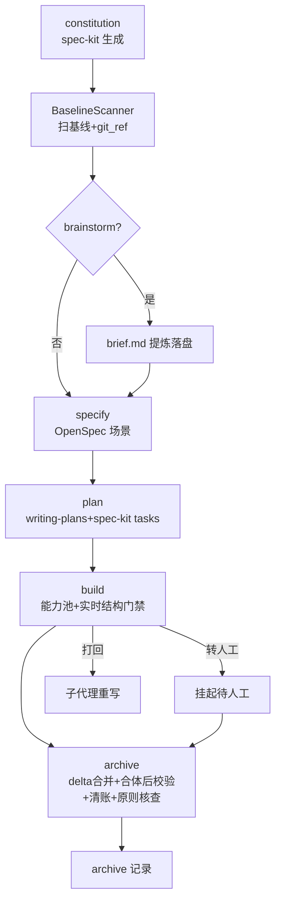
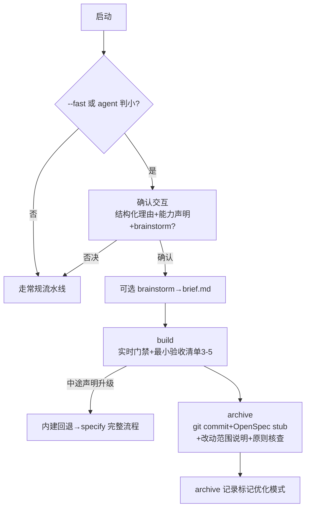
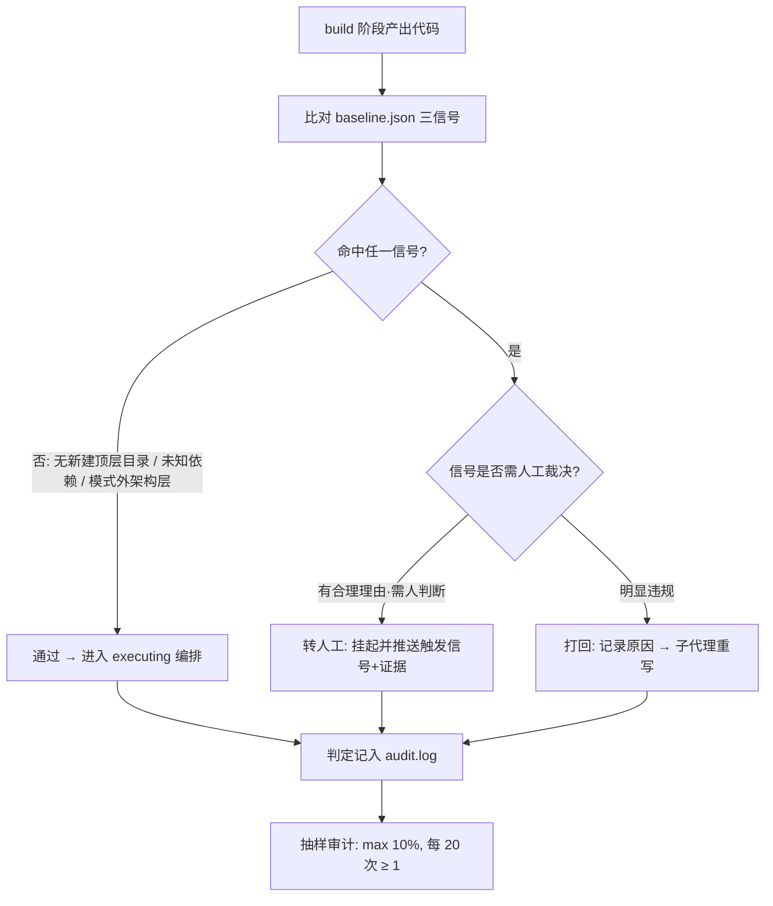
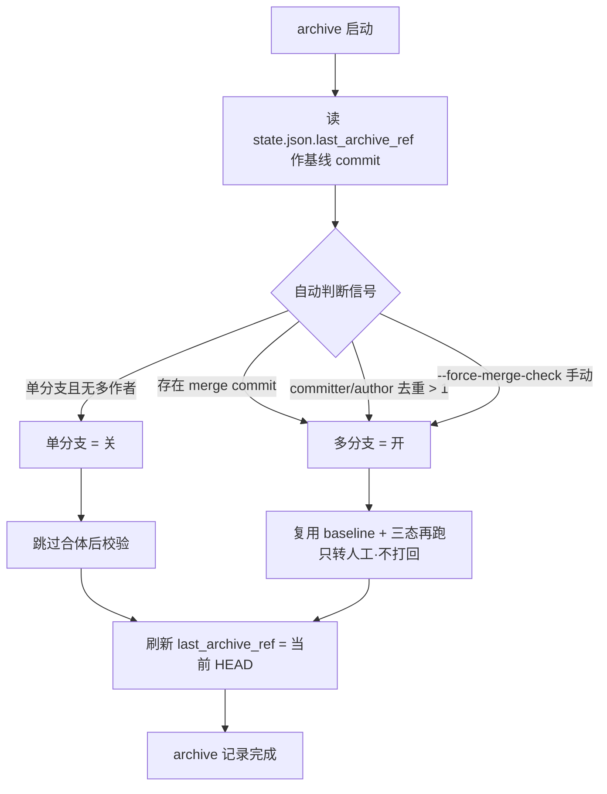
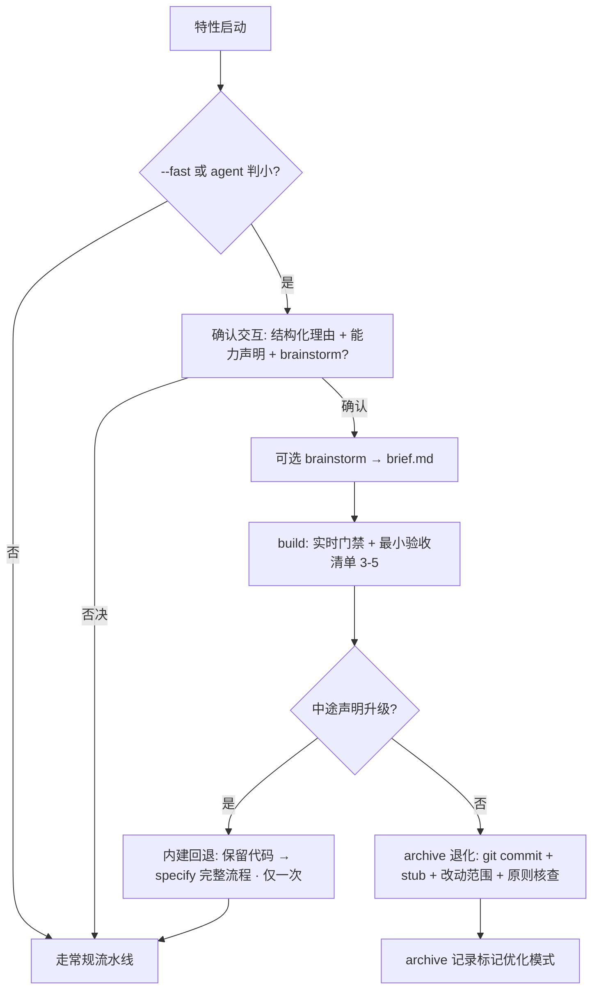

# SpecPowers 桥接插件 · 技术架构方案

> 配套 `桥接插件设计方案-v6.8.md`（设计已定稿，策略 A 锁定，交付模型为 skill 插件 + slash 命令）。本文档承接设计稿，回答"技术架构怎么落地"：技术选型、模块拆分、数据契约、核心流程工程化、功能设计（做什么/怎么做/预期效果）。不含业务领域逻辑，只定骨架与契约。

---

## 1. 背景（Background）

### 1.1 问题来源
团队并存三套能力，但各自只管一段，且都缺两条硬约束：

| 框架 | 强项 | 缺的 |
|---|---|---|
| **OpenSpec** | 场景化 spec（`WHEN/THEN`）、archive delta 合并 | 无"结构一致性"约束；无实时卡转人工 |
| **spec-kit** | `constitution` 原则生成、task 拆解 | 无执行编排；无结构门禁 |
| **superpowers** | brainstorming / writing-plans / executing / worktree / subagent / TDD 执行纪律 | 无结构基准；无统一收尾校验 |

直接后果：agent 经常"无中生有"建目录、引无关依赖、跨分支合并后结构冲突，且没有一个统一收口点把三套能力串成一条可审计的流水线。

### 1.2 为什么是"桥接"而非"重写"
三套框架的引擎本身是被验证过的，重写 = 重新造一遍且背上长期维护债。设计锁定 **Facade + Adapter + Dispatcher**：只做"共享契约 + 适配器翻译 + 按需路由 + 两条硬门禁"，原生引擎原封不动。这决定了本插件**不是一个常驻服务，而是一个"嵌在 agent 上下文里的编排层 + 一组薄脚本"**。

### 1.3 当前状态
- 设计已定稿 v6.8（含优化模式、`/specpowers.fast`、内建回退、最小验收清单、相对阈值基线刷新、stub 入口统一；交付模型为 skill 插件 + `/specpowers.*` slash 命令）。
- 实现待启动，本文档为落地前的架构基线。

---

## 2. 目标（Goals）

### 2.1 功能目标
1. **统一流水线**：`constitution → brainstorm(可选) → specify → plan → build → archive`，优化模式可跳过 specify/plan。
2. **两条硬门禁**（插件独有）：结构一致性门禁（实时三态）、archive 合体后校验（自动判断多分支开/单分支关）。
3. **优化模式**：小特性快速通道，含 agent 判小 / `--fast` / 内建回退 / 最小验收清单。
4. **可追溯收尾**：archive 记录 + 优化模式 OpenSpec stub 入口统一。

### 2.2 非功能目标（架构硬指标）
| 指标 | 目标 | 对应设计原则 |
|---|---|---|
| 零配置开箱即用 | 用户无需写规则文件即可跑结构门禁 | 原则⑨ |
| 弱耦合 | 门禁判据不读任何框架内部模型（只依赖 git + 通用文件） | 原则③ / §3.2.5 |
| 可复用 | 一套引擎代码跑多项目，基线自动扫 | §3.2.5 |
| 可审计 | 每个产物有下游消费者，build 判定可抽样复核 | 价值闸门 / §3.2.3 |
| 一致性 | 常规/优化两模式 constitution 注入策略统一（惰性指针） | 决策⑬/⑳ |

### 2.3 本架构成功度量
- 结构门禁触发准确率（转人工/打回）事后抽样不通过率 < 30%。
- 优化模式误判（小特性走完整 / 大特性走优化）通过测试集回归 < 20%。
- 桥接层对三框架升级的适配成本 = 0（不读内部模型）。

---

## 3. 技术选型（Tech Selection）

### 3.1 运行时模型（关键认知）
本插件的"计算引擎"是 **LLM agent 本身**，由提示词契约（SKILL.md / 阶段指令）驱动；桥接层只承担**确定性、可复现**的部分（git 操作、基线扫描、JSON 落盘、stub 生成、抽样记账）。因此技术栈分两层：

| 层 | 技术 | 职责 |
|---|---|---|
| **编排/认知层** | Markdown 指令集（**作为 WorkBuddy skill 插件加载**，用户以 `/specpowers.*` slash 命令调用） | 定序、触发、agent 主观门禁判定、brief.md 提炼、优化模式判断 |
| **确定性执行层** | Python 3.11+（**仅 stdlib**），作为 **skill 插件内部 helper**（非用户 CLI），由 host agent 经 Bash 调用 | 基线扫描、git_ref、refresh、archive 合体后校验触发检测、stub 生成、抽样审计记账 |

### 3.2 选型决策表
| 维度 | 候选 | 选定 | 理由 |
|---|---|---|---|
| 脚本语言 | Python / Node / Shell | **Python 3.11+** | spec-kit 本体即 Python，生态一致；`pathlib`/`subprocess`/`json` 零依赖即可完成全部确定性工作；避免再引入 Node 运行时 |
| git 交互 | GitPython / subprocess | **subprocess 调原生 git** | 不引入第三方依赖，避免版本漂移；git 命令稳定且可读 `ls-tree`/`log`/`diff` |
| 产物存储 | DB / 文件系统 | **文件系统 + git（source of truth）** | 单项目本地使用，产物即 markdown（被 git 跟踪天然可追溯）；无并发写需求，不需要 DB |
| 基线快照 | 规则文件 / 内部 JSON | **内部 JSON（`.specpowers/baseline.json`，不暴露）** | 零配置要求"不外置规则文件"；JSON 仅桥接层读，用户无感 |
| 配置 | YAML/JSON/无 | **无配置文件** | 零配置原则；能力声明走运行级问答（`--fast`/确认交互）而非文件 |
| 可观测性 | 无 / 轻量日志 | **本地 JSONL 审计日志（`.specpowers/audit.log`）** | 支撑事后抽样；不引入外部监控栈 |

### 3.3 依赖清单（最小化）
```
Python 3.11+
  仅标准库：pathlib, subprocess, json, re, datetime, argparse
  无第三方依赖（保持零安装、弱耦合）
宿主：WorkBuddy agent（加载本插件 `SKILL.md` 指令集，用户以 `/specpowers.*` slash 命令调用；确定性层由 skill 经 Bash 触发 `bridge/` helper）
```

### 3.4 确定性层工程底线（安全 / 健壮 / 并发）
桥接层虽薄，但确定性部分直接碰 shell 与本地文件，下列是落地的**硬底线**（设计稿未强调，但实现躲不掉）：
- **subprocess 安全调用**：调 git 一律用**参数列表**（`subprocess.run(["git","ls-tree","HEAD"])`），**禁止字符串拼接 + `shell=True`**；路径、分支名、特性名均来自外部输入或工作区，拼 shell 即命令注入隐患。所有 git 调用走 `capture_output=True, text=True`，**超时按操作类型分级**——`ls-tree`/`rev-parse` 等已知轻量操作用 30s；`git log --since=...` 等范围查询用 120s（大时间范围可能慢），防挂死同时避免大仓误杀。
- **前置校验 / 失败路径**：进入特性级前必须校验——① 当前目录是 git 仓库（`git rev-parse --is-inside-work-tree`）；② 非 detached HEAD（detached 时拒绝 build/archive 并提示先开分支）；③ 非空仓库（无 commit 时 BaselineScanner 退化为空基线并提示）；④ git 可执行（缺失即报错退出，不让 agent 静默继续）；⑤ 进入 build/archive 前 `constitution.md` + `baseline.json` 必须存在，否则 Dispatcher 拒绝开工。
- **并发 / 重入**：同项目同时跑两条流水线会写坏 `state.json`/`audit.log`。策略：桥接层对 `.specpowers/` 加**文件锁**——写 `.specpowers/.lock` 文件 + `rename` 原子操作实现（全平台通用，不依赖 `fcntl`/`msvcrt` 等平台特定 API），拿不到锁即拒绝启动并提示"已有实例运行中"；`state.json` 更新用"读-改-写单事务"——先写临时文件再 `rename` 原子替换，避免半写损坏。


---

## 4. 整体架构（Overall Architecture）

### 4.1 拓扑
```
┌──────────────────────────────────────────────────────────┐
│                    SpecPowers Facade                       │  门面：定序 + 触发 + 入口参数解析
├──────────────────────────────────────────────────────────┤
│   Dispatcher（阶段路由 + 惰性指针注入 + 自动读取契约强制）  │
├──────────┬──────────┬──────────┬───────────────────────────┤
│ Adapter  │ Adapter  │ Adapter  │  Bridge Modules（插件独有）│
│ OpenSpec │ spec-kit │superpowers│  BaselineScanner          │
│          │          │          │  StructureGate(三态)       │
│          │          │          │  ModeController(优化模式)  │
│          │          │          │  ArchiveAuditor           │
│          │          │          │  SamplingAuditor          │
│          │          │          │  ArtifactRegistry(产物清单)│
└──────────┴──────────┴──────────┴───────────────────────────┘
      │           │            │
┌─────┴────┐ ┌────┴─────┐ ┌───┴──────────┐
│ OpenSpec │ │ spec-kit │ │ superpowers  │   原生引擎（不改动）
│  引擎    │ │  引擎    │ │  技能集       │
└──────────┘ └──────────┘ └──────────────┘

内部存储（用户无感）：
  .specpowers/baseline.json   结构基线快照（带 git_ref）
  .specpowers/audit.log       build 门禁判定记账（供抽样）
  .specpowers/state.json      当前流水线阶段 / 模式 / 回退标记
  .specpowers/judge-tests.json 判小分类器测试集（内部工具链）
  .specpowers/.lock           文件锁（防重入）
```

### 4.2 模块职责
| 模块 | 类型 | 职责 | 关键接口 |
|---|---|---|---|
| **Facade** | 指令+薄壳（skill 门面） | 解析 `/specpowers.*` slash 命令入口（`.constitution` / `.brainstorm` / `.specify` / `.fast` / `.plan` / `.build` / `.archive` / `.baseline` / `.reset` / `.status`），定序，调用 Dispatcher；`fallback_to_full()` 为运行时自然语言交互（非命令，见 §4.5） | slash 命令 → Dispatcher.route(stage, mode) |
| **Dispatcher** | 指令+逻辑 | 阶段路由；注入惰性指针；**强制自动读取契约**（缺必读产物不开工）；按能力声明路由 build 能力池 | route(stage), enforce_auto_read(contract) |
| **Adapter.OpenSpec** | 适配器 | 翻译需求→OpenSpec 场景；复用 archive delta 合并；优化模式绕过，改落 stub | to_scenario(), archive_delta(), write_stub() |
| **Adapter.spec-kit** | 适配器 | 触发 `/speckit.constitution`；复用 task 生成 | gen_constitution(), gen_tasks() |
| **Adapter.superpowers** | 适配器 | 触发 brainstorming / writing-plans(瘦身) / executing / worktree / subagent / TDD；**brainstorming 收尾时由 brainstorming agent 自身按收口契约输出结构化 summary，桥接层仅负责落盘为 `brief.md`，不做二次抽取** | run_skill(name, ctx), persist_brief(summary) |
| **BaselineScanner** | Python 脚本 | 扫 `git ls-tree HEAD` + 依赖清单 + `src/` 二级目录，出 `baseline.json`（带 git_ref） | scan() → baseline.json |
| **StructureGate** | 提示契约+脚本辅助 | build 实时三态判定（通过/转人工/打回）；archive 合体后校验（自动判断） | judge(tree_diff, baseline) → state |
| **ModeController** | 指令+逻辑 | 优化模式判断（agent 判小 / `--fast`）、确认交互、内建回退、最小验收清单生成 | is_small(req), confirm(), fallback_to_full() |
| **ArchiveAuditor** | 指令+脚本 | 清账转人工挂起、constitution 原则证据核查、收尾产物、合体后校验调度、stub 生成、改动范围说明生成 | audit(), write_stub(), change_summary() |
| **SamplingAuditor** | Python 脚本 | 记录每次 build 门禁判定；按 10% 或每 20 次至少 1 次抽样，输出待审清单 | log(decision), sample() |
| **ArtifactRegistry** | 常量表+逻辑 | 维护全部产物的权威清单（位置/模式/生产者/消费者/必产判定），作为自动读取契约与价值闸门的单一事实源 | manifest(), required_for(stage, mode) |

### 4.3 数据契约（Schema）
```json
// .specpowers/baseline.json（内部，不暴露）
{
  "git_ref": "abc1234",                 // 基线对应 commit
  "scanned_at": "2026-07-22T10:00:00+08:00",
  "top_dirs": ["src", "tests", "docs"], // git ls-tree HEAD 顶层
  "deps": ["express", "react"],         // 依赖清单自动识别
  "src_patterns": ["src/handlers", "src/utils"], // src/ 二级目录命名规律
  "constitution_hash": "sha256:9f3a..."   // constitution.md 快照 hash，build/archive 时重算比对，不一致触发重扫（见 §6.1 step2①）
}

// .specpowers/state.json（内部）
{
  "stage": "constitution|ready|brainstorm|specify|plan|build|archive",
                                          // 合法值按状态机过渡规则（见下）
  "mode": "regular|fast",               // 模式
  "fallback_used": false,               // 是否已回退（只允许一次）
  "feature": "add-cache-layer",
  "last_archive_ref": "abc1234"         // 上次 archive 对应 commit，合体后校验"自上次以来"的基线范围（见 §6.1 step4）
}

// state.json 生命周期
// - 创建：首次进入项目（无参冷启）或 `/specpowers.constitution` 时自动创建，初始 stage="constitution", mode="regular", fallback_used=false, last_archive_ref=""（空字符串）
// - 更新：Dispatcher 每次阶段切换时写 stage/mode；回退时 fallback_used=true；archive 完成后刷新 last_archive_ref 为当前 HEAD
// - 重置：`/specpowers.reset` 删 state.json + `.specpowers/.lock`（不碰 baseline.json/audit.log），用于状态卡死或崩溃残留锁恢复后重新进入流水线
// - 冷静启动：state.json 不存在 + 无参数运行 → 自动视为 constitution 阶段，创建 state.json 并触发生成 constitution.md + 基线快照；last_archive_ref 为空时合体后校验退化为"全量历史对比"

// 状态机过渡规则（stage 字段的合法值及跃迁）
// constitution → ready（项目级一次完成后进入等待态，等待使用者提供特性需求）
// ready → brainstorm | specify（使用者描述特性后 agent 写 feature 字段 + 跳转 stage；是否跑 brainstorm 由使用者决定；优化模式下直接跳 build）
// brainstorm → specify（brief.md 落盘后自动跳转）
// specify → plan（spec.md 产出后自动跳转）
// plan → build（plan.md 产出后自动跳转）
// build → archive（代码产出 + 门禁通过）
// archive → ready（收尾完成，回等待态，准备下一特性）
// 任何 stage → ready（回退触发：fallback_to_full() 从 build 跳回 specify，archive 后回 ready）
//
// 特性启动入口：使用者通过自然语言描述新特性 → host agent 调 Facade 隐式入口，
// Facade 检测 state.json.stage == "ready" → 写 feature 名 + 跳转 stage 为 brainstorm 或 specify（取决于使用者是否选择 brainstorm）；
// 若为优化模式（agent 判小 / `--fast`），跳过 specify/plan，直接设 stage="build"。

// brief.md（提炼产物，必然产出若跑了 brainstorm）
## 目标
- <一句话说清特性目标>（必有）
## 关键决策（若有）
- 决策：<方案>  理由：<为什么>
## 被拒方案（若有）
- 方案：<考虑过但放弃>  放弃理由：<为什么不行>
## 已决开放问题（若有）
- 问题：<暂不定>  当前结论：<先按 X>

// plan.md 任务单元（writing-plans 瘦身 + spec-kit tasks 合并）
- [ ] T1 <任务描述> | 场景: spec.md#S2 | 验收: <可测条件> | 依赖: T0 | test-first: true | cap: [worktree,subagent]

// OpenSpec stub（优化模式 archive）
模式: 优化模式(fast)
git_commit: <hash>
改动范围: <3-5 句：改了什么文件、影响什么行为>
```

### 4.3.1 审计日志格式（audit.log）
```jsonl
{"seq":1,"ts":"2026-07-22T10:05:00+08:00","stage":"build","gate":"structure","result":"pass|human|reject","signals":["new_top_dir:src/foo"],"confidence":"high|mid|low","sampled":false,"git_ref":"abc1234"}
```
- `seq`：单调递增判定序号，取 audit.log 末行 `seq+1` 持久化，支撑「每 20 次至少 1 次」下限（seq 满 20 且期间 `sampled=true` 次数=0 → 强制该次 `sampled=true`）。
- `sampled`：是否被抽中复核；与 10% 随机路取并集。
- 追加写、不删、不覆盖，天然适配并发（见 §3.4）。

### 4.4 产物清单（Artifact Inventory）

插件全量产物的权威登记。位置 = 项目内相对路径（内部存储以 `.specpowers/` 前缀，用户无感）；此表是 §6.3 自动读取契约与价值闸门的**单一事实源**，Dispatcher 每阶段切换时据此校验"缺必读不开工"与"本阶段应产产物有消费者"。

| 产物 | 层级 | 存储位置 | 生产者 | 消费者 | 是否必须 | 生命周期 / 刷新 |
|---|---|---|---|---|---|---|
| `constitution.md` | 项目级（一次） | 仓库根 | Adapter.spec-kit（`/speckit.constitution`） | build 子代理（惰性指针）；archive 核查 | 必须 | 改之触发基线重扫 |
| `brief.md` | 特性级 | 仓库根 | Adapter.superpowers（brainstorm 收口） | specify 自动输入 / build 上下文(优化) / audit | 条件必须（跑了 brainstorm 即必然产出） | 每特性一轮，优化模式可选 |
| `spec.md` | 特性级 | OpenSpec 目录 | Adapter.OpenSpec（specify） | plan 场景指针；archive delta 源 | 必须（优化模式豁免） | 每特性一轮 |
| `plan.md` | 特性级 | 仓库根 | Adapter.superpowers + spec-kit tasks | build 能力声明/任务；archive 标记完成 | 必须（优化模式豁免） | 每特性一轮 |
| 验收清单（优化模式） | 特性级 | 不落独立文件（build 上下文） | Dispatcher（基于需求+对话生成） | build 子代理自测；archive 清账 | 优化模式必须（3-5 条） | 仅优化模式，build 启动时生成 |
| 结构基线快照 `baseline.json` | 内部 | `.specpowers/baseline.json` | BaselineScanner | 门禁比对；合体后校验 | 自动（非交付物） | 一次扫死；三路刷新 |
| 流水线状态 `state.json` | 内部 | `.specpowers/state.json` | Dispatcher | 阶段路由 / 回退判定 | 自动 | 每次阶段切换更新 |
| 审计日志 `audit.log` | 内部 | `.specpowers/audit.log` | SamplingAuditor | 事后抽样复核 | 自动 | 追加写，不删 |
| archive 记录 | 特性级 | OpenSpec archive 目录 | ArchiveAuditor | 后续轮次变更追溯 | 必须 | 每特性一轮 |
| OpenSpec stub（优化模式） | 特性级 | OpenSpec archive 目录 | ArchiveAuditor（优化 archive） | 后续轮次追溯入口 | 优化模式必须 | 仅优化模式 |
| 代码（diff） | 特性级 | 工作区 / git | build 阶段 | archive（delta 源）；运行时 | 必须 | 持续变更 |

> 内部存储三件套（`baseline.json` / `state.json` / `audit.log`）由桥接层独占，用户无感，可被 `.gitignore` 排除；它们**不计入价值闸门**（非交付物，纯运行时状态）。

### 4.5 Facade 对外暴露面（削减概念暴露面）
设计原则要求对外只暴露 **3 概念 + 2 开关**，内部模块（Adapter / Dispatcher / Bridge Modules）一概不透出。Facade 的 slash 命令入口映射如下：

| 对外概念/开关 | slash 命令（skill 插件调用） | 映射到内部 |
|---|---|---|
| 概念① 项目原则 | `/specpowers.constitution [--force]`（隐式：首次进项目自动触发 spec-kit 生成） | Adapter.spec-kit.gen_constitution + BaselineScanner |
| 概念② 特性流水线 | `/specpowers.brainstorm` `/specpowers.specify` `/specpowers.plan` `/specpowers.build`（各阶段独立显式命令，命令名即阶段名） | Facade → Dispatcher.route(stage) |
| 概念③ 收尾 | `/specpowers.archive [--force-merge-check]` | ArchiveAuditor |
| 开关① 优化模式 | `/specpowers.fast "<需求>"`（显式入口，跳过 agent 判小） | ModeController.is_small + 确认交互跳过 |
| 开关② 基线刷新 | `/specpowers.baseline` | BaselineScanner.scan() 手动触发 |
| 运维（不计概念暴露面） | `/specpowers.reset`（故障恢复）· `/specpowers.status`（调试） | 状态重置 / 状态打印 |

- **调用模型（v6.8 调整）**：最终交付物是 **WorkBuddy skill 插件**，用户以 `/specpowers.*` slash 命令调用；内部确定性工作（基线扫描 / stub / 抽样 / 状态 / 锁）由 skill 经 Bash 调 `bridge/` Python helper 完成，对用户透明。`bin/specpowers` 仅为 skill 内部薄壳，对外不可见。
- `fallback_to_full()`（内建回退）是**运行时自然语言交互**（build 中途声明「升级为完整流程」）而非命令入口，不列入对外暴露面，避免概念膨胀。
- `/specpowers.reset` 为**故障恢复入口**：删除 `state.json` + `.specpowers/.lock`（不碰 baseline.json/audit.log），用于状态卡死或崩溃残留锁时恢复；归入运维命令，不计入概念暴露面。
- 所有阶段名（build/plan/specify）、能力声明（worktree/subagent/TDD）、产物清单均为内部契约，用户通过 slash 命令或确认交互驱动。
- 命名空间 `specpowers.` 对齐 `/speckit.constitution` 框架级技能命名惯例，避免与 superpowers 裸名技能（brainstorming 等）冲突。
- 这一映射是「削减概念暴露面」原则在架构层的硬落点，也是用户速查的入口锚点。

---

## 5. 整体流程（Overall Flow）

### 5.1 常规流水线


### 5.2 优化模式（fast / agent 判小）


---

## 6. 核心流程（Core Flow）

### 6.1 结构门禁（插件独有硬约束）
1. **基线生成（一次性）**：constitution 阶段 `BaselineScanner.scan()` 读三个通用源 → 写 `baseline.json`（带 `git_ref` + `constitution_hash`）。不增量刷新。**边界**：`constitution.md` 只承载质量/测试/UX/性能等**原则**，绝不承载结构规则——结构判定完全来自 baseline，禁止把"该建什么目录/引什么依赖"塞进 constitution（否则弱耦合护城河失效）。
2. **刷新触发**：① `constitution.md` 改动检测——**首次生成 baseline.json 时记录 `constitution_hash`**（§4.3）；之后**每次 build/archive 阶段启动时重算当前 `constitution.md` 的 `sha256`**，与 `baseline.json.constitution_hash` 比对，不一致即自动重扫基线并刷新 hash（lazy 检测，非文件监听）；② `/specpowers.baseline` 手动；③ build 时读 `git_ref` 发现过期（>30 天 或 距 HEAD commit > 月均×2）→ 提示"基线过期，拿不准转人工"。
3. **实时判定（build 每次产出即卡）**：agent 比对三类信号——新建基线没有的顶层目录 / 引入未知依赖 / 在既有模式外新建架构层 → 三态：
   - ✅ 通过 → 进入 executing 编排
   - 🔄 转人工 → 挂起推送人工（含触发信号+证据），不自动决策
   - ❌ 打回 → 记录原因，子代理重写
4. **合体后校验（archive，自动判断）**：以 `state.json.last_archive_ref` 为基线 commit，检测其至今是否有 merge commit / 多作者 → 多分支开、单分支关；复用 baseline + 三态逻辑再跑一次；**只转人工不打回**。**检测局限与兜底**：rebase / squash / cherry-pick 工作流不产生 merge commit，仅靠 merge commit 信号会漏判；补充信号——committer/author 去重计数 >1（多作者）；并提供手动 `--force-merge-check` 开关，使用者显式要求时**绕过自动判断强制开启**合体后校验，覆盖上述漏判。**写入点**：校验完成后（无论开关开闭）将 `state.json.last_archive_ref` 刷新为当前 HEAD，作为下一轮「自上次 archive 以来」的基线范围（首轮该字段为空，则退化为"全量历史对比"）。
5. **兜底（事后抽样）**：每次 build 判定记 `audit.log`；抽样 = max(10%, 每 20 次至少 1 次)；不通过率 >30% → 收紧 agent 判据 prompt。

#### 6.1.1 结构门禁三态判定流程图（build 实时）


#### 6.1.2 合体后校验自动判断流程图（archive）


### 6.2 优化模式核心流程
- **判小**：agent 读需求，按性质信号 {bugfix, 单文件, 无新场景, 纯配置, 纯文案, 纯重构} 判断；输出格式 `[理由：<信号>/...，置信度：<高/中/低>]`；判小才提示，其他默认走完整。
- **确认交互（结构化）**：一并采集——是否走优化模式、是否跑 brainstorm、是否开 TDD（**禁止 worktree/subagent**）。
- **最小验收清单**：Dispatcher 基于需求+对话生成 3-5 条；<3 拒绝、>5 提示回退。
- **内建回退**：build 中途使用者声明「升级为完整流程」→ 暂停、保留代码（不 commit）、回 specify 完整流程；已写代码作 reference context；只允许一次切回。
- **archive 退化**：git commit + OpenSpec stub（模式标记+hash+改动范围说明）+ 原则核查；跳过 delta 合并与合体后校验。

#### 6.2.1 优化模式判小 / 确认 / 回退流程图


### 6.3 自动读取契约（硬约束）
Dispatcher 在每阶段开工前**强制**读上游产物（只读指针/字段，不整篇塞上下文）：
- specify 前读 `brief.md`(若有) + `constitution` 指针
- plan 前读 `spec.md` + `brief.md`(若有) + `constitution` 指针
- build 前读 `plan.md` + `spec.md` 场景 + `baseline.json`(含 git_ref) + `constitution` 指针（优化模式读需求+对话+验收清单+能力声明+brief.md(若选)）
- archive 前读 `plan.md`/`spec.md`(优化豁免) + `brief.md` + 转人工挂起清单 + 验收清单(优化) + `baseline.json`(自动判断)
- **缺必读产物 → Dispatcher 拒绝开工**，先补产物（与价值闸门互补）。

#### 6.3.1 自动读取契约校验流程图
```mermaid
flowchart TD
    D0[Dispatcher.route 阶段切换] --> D1{required_for(stage, mode) 校验}
    D1 -->|缺必读产物| D2[拒绝开工: 先补产物]
    D1 -->|必读齐全| D3[仅读指针/字段加载<br/>不整篇塞上下文]
    D3 --> D4[进入该阶段]
```

---

## 7. 功能设计（做什么 / 怎么做 / 预期效果）

### 7.1 结构基线扫描（BaselineScanner）
| 项 | 内容 |
|---|---|
| **做什么** | constitution 阶段一次性扫描项目结构，产出带 `git_ref` 的基线快照，作为门禁比对靶子 |
| **怎么做** | Python 脚本：`git ls-tree HEAD` 取顶层目录；按扩展名识别 `package.json/pom.xml/requirements.txt/go.mod/Cargo.toml` 取依赖；遍历 `src/` 二级目录归纳命名规律；写入 `.specpowers/baseline.json`。刷新三路：constitution.md 改动监听、手动 `refresh-baseline`、git_ref 相对阈值过期提示 |
| **预期效果** | 零配置、用户无感；门禁有稳定靶子；git_ref 给 agent "基线是否过期"的额外信号，降低误杀 |

### 7.2 实时结构门禁（StructureGate）
| 项 | 内容 |
|---|---|
| **做什么** | build 阶段每次产出即时校验代码是否契合现有结构，三态结果 |
| **怎么做** | 提示契约驱动 agent 主观判定（三信号比对 baseline）；转人工/打回消息必须含触发信号+具体证据；判定结果记 `audit.log`；事后抽样 max(10%, 每 20 次≥1) 复核 |
| **预期效果** | 早卡早省返工；零配置（无规则文件）；抽样兜底防止"放羊/保守"两种失效模式 |

### 7.3 能力池调度（Capability Dispatcher）
| 项 | 内容 |
|---|---|
| **做什么** | build 阶段按使用者显式声明启用 worktree/subagent/TDD，executing 默认 conductor |
| **怎么做** | 常规模式读 `plan.md` 任务上的能力标记；优化模式在确认交互采集（仅 TDD，禁 worktree/subagent）；Dispatcher 如实接线，不按规模自适应 |
| **预期效果** | "按需"主语在使用者，符合"使用者作主"原则；不替使用者拍板，行为可预期 |

### 7.4 优化模式（ModeController）
| 项 | 内容 |
|---|---|
| **做什么** | 小特性快速通道：跳过 specify/plan，含 agent 判小 / `--fast` / 确认交互 / 内建回退 / 最小验收清单 |
| **怎么做** | 启动判断（信号集合+置信度结构化输出）；`--fast` 跳过判断；确认时采能力声明+brainstorm 选项；Dispatcher 生成 3-5 条验收清单；`fallback_to_full()` 触发一次性回退保留代码；前置检查 constitution+基线存在否则拒开工 |
| **预期效果** | 改 2 行 bug 不再走完重产物；保留可追溯（stub+改动范围）；回退路径消除"硬走完/放弃重来"的两难 |

### 7.5 Archive 桥接职责（ArchiveAuditor）
| 项 | 内容 |
|---|---|
| **做什么** | 复用 OpenSpec delta 合并，额外做四件：清账转人工挂起、constitution 原则证据核查、收尾产物、合体后结构校验（自动判断） |
| **怎么做** | 合体后校验开关除 merge commit/多作者自动判断外，支持手动 `--force-merge-check` 强制开启（覆盖 rebase/squash 漏判，见 §6.1 step4）；清账前强制了结所有转人工挂起；轻量核查测试是否执行/性能回归；优化模式绕过原生命令改 git commit + stub + 改动范围说明（仍做原则核查）。**改动范围说明（change_summary）方法**：脚本先产出 `git diff --stat` 统计（文件数/增删行）作为输入，由 **archive 阶段的 agent（即当前对话中的 agent）基于差异语义生成 3-5 句自然语言说明**（非纯脚本 diff dump，也非独立 agent 调用），保证可读性与审计价值 |
| **预期效果** | 收尾有统一入口（常规+优化都在 OpenSpec archive 可查）；合体后冲突被抓；收尾语义不被打回破坏（只转人工） |

### 7.6 自动读取契约（Auto-Read Contract）
| 项 | 内容 |
|---|---|
| **做什么** | 强制每阶段开工前读所需上游产物，消除"agent 忘加载上游凭空开干" |
| **怎么做** | Dispatcher 内置阶段→必读产物映射表；只读指针/字段不整篇塞；缺必读产物拒绝进入下一阶段 |
| **预期效果** | 价值闸门"产了必被消费"闭环；降低上下文丢失导致的跑偏/返工 |

### 7.7 事后抽样审计（SamplingAuditor）
| 项 | 内容 |
|---|---|
| **做什么** | 对主观门禁判定做软兜底复核 |
| **怎么做** | 每次 build 判定写 `audit.log`；抽样率 max(10%, 每 20 次≥1)；不通过率>30% 触发 prompt 收紧 |
| **预期效果** | 不破坏零配置，给主观判定一个可观测、可校准的闭环 |

### 7.8 constitution 惰性注入
| 项 | 内容 |
|---|---|
| **做什么** | build/archive 阶段按需读取质量/测试/UX/性能原则 |
| **怎么做** | 传文件路径指针（约 20 行），子代理"真改变行为时"才读，不 `<context>` 全量内联；常规/优化模式策略统一 |
| **预期效果** | 省 token、避免漂移；两模式行为一致，消除隐式差异 |

### 7.9 产物清单（Artifact Registry）
| 项 | 内容 |
|---|---|
| **做什么** | 维护插件全部产物的权威清单（位置 / 模式适用性 / 生产者 / 消费者 / 必产判定），作为自动读取契约"缺必读不开工"与价值闸门"产了必被消费"的**单一事实源** |
| **怎么做** | 在 Dispatcher 内置静态 manifest（代码常量，无配置文件，符合零配置）：每个产物登记 `层级 / 路径 / 生产者 / 消费者[] / 必产规则`；必产规则支持模式维度（如 spec.md/plan.md 常规必须、优化豁免；stub/验收清单仅优化必须）。阶段切换时 Dispatcher 调 `required_for(stage, mode)` 校验：上游必读产物缺失→拒绝开工；本阶段应产产物**有声明消费者（延迟消费如后续轮次追溯/audit 接受）**→否则拦截（价值闸门兜底）。优化模式切换、内建回退时 manifest 动态生效（回退后 spec/plan 重新标记为必产） |
| **预期效果** | 自动读取契约与价值闸门有统一依据，不再散落各阶段 prompt；新增产物只需在 manifest 登记一处即被门禁与契约自动覆盖；杜绝产物漏产、漏读、常规/优化两套体系分裂 |

---

### 7.10 writing-plans 瘦身（Plan 产物归并）
| 项 | 内容 |
|---|---|
| **做什么** | plan 阶段把 spec-kit 生成的细碎 tasks 合并进 `plan.md` 单一任务单元，砍掉冗余中间产物，降低常规/优化模式的产物割裂 |
| **怎么做** | Adapter.superpowers 调 writing-plans 时加瘦身约束：① 将 spec-kit 的 tasks 按「场景（WHEN/THEN）」归并，每条 `plan.md` 任务单元挂 `场景: spec.md#Sx` 指针而非独立 task 文件；② 任务单元字段固定（描述/场景/验收/依赖/test-first/cap），与 §4.3 契约一致；③ 优化模式本就豁免 `plan.md`，瘦身只作用于常规模式；④ 合并后保留能力标记（worktree/subagent/TDD）供能力池调度 |
| **预期效果** | 常规模式 plan 更紧凑、与 spec.md 显式挂钩；优化模式跳过 plan 时语义一致（都围绕 spec.md 场景）；减少 agent 在 plan 阶段的信息丢失 |

### 7.11 判小分类器测试集与回归
| 项 | 内容 |
|---|---|
| **做什么** | 为优化模式「判小」提供可回归测试用例集，量化 §2.3 的「<20% 误判」指标，使 agent 判据可校准而非凭感觉 |
| **怎么做** | ① 测试集存 `.specpowers/judge-tests.json`（内部工具链，与 baseline.json/audit.log 同级），每条 = {需求描述, 期望判定: small\|full, 期望信号[], 备注}；规模 10-20 条覆盖 {bugfix, 单文件, 无新场景, 纯配置, 纯文案, 纯重构, 跨模块, 新场景} 等；② 运行方式：agent 离线对每条需求跑判小，输出结构化判定与期望比对；③ 指标：误判率 = 错判条数/总条数，目标 <20%；④ 回归门槛：每次调判据 prompt 后必须重跑，误判率回升即阻断发布；⑤ 测试集随真实误判案例持续补充（发现漏判即加一条） |
| **预期效果** | 判小从「主观感觉」变「有基线、可回归、可校准」；EM 担心的滥用有数据护栏；与设计稿 §9 待办对齐 |

---

## 8. 关键风险与架构评审视角（多角色张力）

设计已定，但落地有真实张力。下表把不同角色的顾虑摆出来，不粉饰：

| 角色 | 核心顾虑 | 架构怎么接 | 残余风险 |
|---|---|---|---|
| **一线开发** | agent 主观门禁"时严时松"，同一改动今天过明天转人工 | 抽样审计 + 结构化信号 + git_ref 过期提示 | 不可回归测试，跨 agent 不可重复（设计已接受） |
| **QA** | 优化模式无 spec.md，验收靠 3-5 条清单，回归保护弱 | 最小验收清单 + 需求描述 + build 门禁 + code review | 失去 WHEN/THEN 的回归锚点（设计明确代价） |
| **DevEx** | 桥接层维护成本：三框架升级要跟 | 判据只依赖 git+通用文件，不读内部模型 | 框架改 CLI 输出语义才可能受影响（低概率） |
| **EM** | 优化模式会不会被滥用（大特性也走 `--fast`） | >5 条清单提示回退 + 判小信号约束 + 测试集回归 | 依赖使用者自律 + agent 判据质量 |
| **可靠性** | 基线"一次扫死"长期项目误杀 | 三路刷新 + git_ref 提示 + 转人工兜底 | 误杀仍存在但可被人工纠正 |
| **安全/合规** | 内部 `.specpowers/` 是否泄露结构信息 | 仅本地、git 可加 ignore；不含密钥 | 需约定不提交敏感基线 |

**架构师结论**：张力集中在"零配置 vs 确定性"——设计选择用"agent 主观 + 抽样兜底"换零配置，这是有意的权衡，落地重点是**把抽样审计和判据 prompt 调优做成可迭代闭环**，而非追求门禁 100% 客观化。

---

## 9. 实现路线图（映射到模块）

| 设计稿 §9 待办 | 本文档模块 | 优先级 |
|---|---|---|
| dispatcher 降级为 Facade+3 Adapter | Facade / Adapter.* | P0 |
| constitution 接线 | Adapter.spec-kit | P0 |
| 基线扫描 + 实时门禁 | BaselineScanner / StructureGate | P0 |
| 基线刷新三路 | BaselineScanner | P1 |
| archive 合体后校验 | ArchiveAuditor + StructureGate | P1 |
| writing-plans 瘦身 | Adapter.superpowers | P1 |
| 五技能接线 | Adapter.superpowers + Dispatcher | P1 |
| 优化模式（判小/确认/回退/清单） | ModeController | P0 |
| 优化模式 archive（stub + 改动范围说明） | ArchiveAuditor | P0 |
| `--fast` 入口 | Facade | P1 |
| 抽样审计 | SamplingAuditor | P2 |
| 产物清单（价值闸门/自动读取契约依据） | ArtifactRegistry（内置 manifest） | P1 |
| 真实特性验证 + token 实测 | 集成测试 | P0 |
| 判小测试集与回归（<20% 误判护栏） | ModeController + SamplingAuditor | P2 |
| `--force-merge-check` 兜底（覆盖 rebase/squash 漏判） | ArchiveAuditor | P2 |

**优先级粒度对齐**：设计/架构方案以 P0/P1/P2 表达优先级（P0=脚手架/门禁/优化/真实验证，P1=刷新/合体校验/能力池/产物清单，P2=抽样/判小回归/force-merge）；实现方案进一步细化为 **P0–P7** 的构建顺序（见实现方案 §5），二者方向一致，本表模块映射可直接套用。交付模型上，实现方案已锁定为 **skill 插件 + `/specpowers.*` slash 命令**（v6.8），本架构 §3.1 / §4.5 已同步。

---

## 10. 可观测性（Monitoring）

虽为本地插件，仍需最小可观测闭环支撑"抽样审计"与"调优"：
- **指标**（写 `audit.log` JSONL）：每次 build 的门禁判定（状态/信号/置信度）、优化模式触发次数、回退次数、合体后校验开关命中、抽样复核不通过率。
- **告警**：抽样不通过率 >30% → 提示收紧判据 prompt；基线过期率突增 → 提示项目结构演进快、需更频繁 refresh。
- **追溯**：archive 记录 + stub 构成完整演进史，闭环到下一轮 baseline 复用。

---

> 本架构方案与 `桥接插件设计方案-v6.8.md` 互为补充：设计稿定"做什么/为什么"，本文档定"技术架构怎么落地"。实现启动时按 §9 路线图映射到模块逐一落地。
